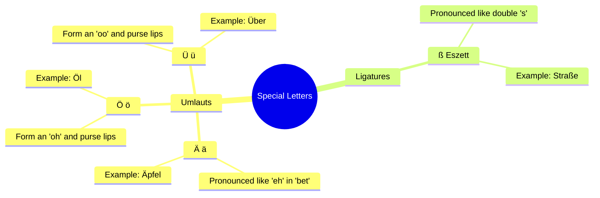

# Chapter 1: The German Alphabet (Das deutsche Alphabet)

To master German, you must start with its building blocks: the alphabet. While the German alphabet uses the same Latin script as English, it contains **26 standard letters**, **3 Umlauts** (Ä, Ö, Ü), and **1 special ligature** (ß). 

---

## The Alphabet Table

Here is the complete German alphabet. Study the pronunciation guide carefully. The pronunciation represents how the letter is named when spelling out a word (e.g., spelling your name over the phone).

| Letter (Upper) | Letter (Lower) | Pronunciation Guide | Example Word | English Translation |
| :--- | :--- | :--- | :--- | :--- |
| **A** | **a** | Ah | **A**pfel (*AH-pfel*) | Apple |
| **B** | **b** | Bay | **B**irne (*BEER-nuh*) | Pear |
| **C** | **c** | Tsay | **C**hemie (*KHEM-ee*) | Chemistry |
| **D** | **d** | Day | **D**ach (*dahkh*) | Roof |
| **E** | **e** | Ay | **E**sel (*AY-zel*) | Donkey |
| **F** | **f** | Eff | **F**isch (*fish*) | Fish |
| **G** | **g** | Gay | **G**las (*glahs*) | Glass |
| **H** | **h** | Hah | **H**aus (*house*) | House |
| **I** | **i** | Ee | **I**gel (*EE-gel*) | Hedgehog |
| **J** | **j** | Yot | **J**acke (*YAH-kuh*) | Jacket |
| **K** | **k** | Kah | **K**atze (*KAHT-suh*) | Cat |
| **L** | **l** | Ell | **L**ampe (*LAHM-puh*) | Lamp |
| **M** | **m** | Emm | **M**aus (*mouse*) | Mouse |
| **N** | **n** | Enn | **N**ase (*NAH-zuh*) | Nose |
| **O** | **o** | Oh | **O**bst (*ohpst*) | Fruit |
| **P** | **p** | Pay | **P**apier (*pah-PEER*) | Paper |
| **Q** | **q** | Koo | **Q**uelle (*KVEL-uh*) | Source |
| **R** | **r** | Err | **R**ose (*RO-zuh*) | Rose |
| **S** | **s** | Ess | **S**onne (*ZON-uh*) | Sun |
| **T** | **t** | Tay | **T**ee (*tay*) | Tea |
| **U** | **u** | Oo | **U**hr (*oor*) | Clock / Watch |
| **V** | **v** | Fow | **V**ogel (*FO-gel*) | Bird |
| **W** | **w** | Vay | **W**asser (*VAHS-ser*) | Water |
| **X** | **x** | Iks | **X**ylofon (*ksy-lo-FOHN*) | Xylophone |
| **Y** | **y** | Upsilon | **Y**oga (*YO-gah*) | Yoga |
| **Z** | **z** | Tsett | **Z**ug (*tsook*) | Train |

---

## Special German Letters

German features four unique letters that do not exist in the standard English alphabet.

### 1. The Umlauts (Ä, Ö, Ü)
An Umlaut represents a historical sound shift. The two dots above the vowel alter its sound:
* **Ä / ä**: Pronounced like the "e" in "bet" or the "a" in "late" (without the gliding "y" sound).
  * *Example*: **Äther** (*AY-ter*) — Ether
* **Ö / ö**: Pronounced by placing your tongue in position to say "ay" (as in *play*), but rounding your lips as if saying "oh". 
  * *Example*: **Öl** (*erl*) — Oil
* **Ü / ü**: Pronounced by placing your tongue in position to say "ee" (as in *see*), but rounding your lips tightly as if saying "oo".
  * *Example*: **Über** (*EW-ber*) — Over / About

> [!TIP]
> If you cannot type Umlauts on your keyboard, you can substitute them by adding an "e" after the vowel:
> * **ä** becomes **ae** (e.g., *Äpfel* -> *Aepfel*)
> * **ö** becomes **oe** (e.g., *Öl* -> *Oel*)
> * **ü** becomes **ue** (e.g., *über* -> *ueber*)

### 2. The Eszett (ß)
Also known as the *scharfes S* (sharp S), the **ß** character looks like a Greek beta ($\beta$) but is actually a ligature of "s" and "z".
* **Pronunciation**: It is always pronounced as a voiceless "s" (like the "s" in "sister"), never voiced (like the "z" in "zero").
* **Spelling Rule**: Use **ß** after long vowels or diphthongs (e.g., *Straße*, *weiß*). Use **ss** after short vowels (e.g., *Wasser*, *Fluss*).
* *Note*: Switzerland and Liechtenstein do not use **ß** at all; they always write **ss**.

---

## Critical Rules of German Capitalization

German capitalization is strict and non-negotiable. 

1. **ALL Nouns are Capitalized**: Unlike English, where only proper nouns are capitalized, German capitalizes *every single noun*.
   * *English*: The **dog** chases the **ball** in the **garden**.
   * *German*: Der **Hund** jagt den **Ball** im **Garten**.
2. **The Formal "You"**: The pronoun **Sie** (formal "you") and its possessive forms (**Ihr**, **Ihre**) are always capitalized. The informal pronouns (*du*, *ihr*) are not capitalized.
3. **The First Word of a Sentence**: Capitalized exactly as in English.
4. **Languages and Nationalities as Nouns**: Capitalized (e.g., *auf Deutsch* — in German).
