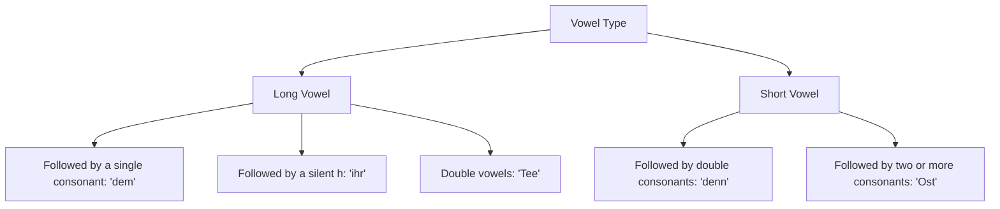

# Chapter 2: German Pronunciation and Phonetics (Aussprache)

German pronunciation is highly phonetic. Unlike English, where spelling can be misleading (e.g., *cough*, *tough*, *through*), German words are almost always pronounced exactly how they are spelled once you learn the foundational rules.

---

## Vowels: Long vs. Short

German vowels can be **long** or **short**. A vowel's length changes its sound quality and can change the meaning of a word entirely.

### Vowel Pronunciation Table

| Vowel | Short Sound (like...) | Short Example | Long Sound (like...) | Long Example |
| :--- | :--- | :--- | :--- | :--- |
| **A / a** | "u" in *cut* | **Mann** (*munn*) | "a" in *father* | **Name** (*NAH-muh*) |
| **E / e** | "e" in *bet* | **Bett** (*bet*) | "ay" in *say* (no 'y' glide) | **dem** (*daym*) |
| **I / i** | "i" in *bit* | **ist** (*ist*) | "ee" in *meet* | **ihn** (*een*) |
| **O / o** | "o" in *pot* | **offen** (*OFF-en*) | "o" in *role* | **ohne** (*OH-nuh*) |
| **U / u** | "u" in *put* | **Mutter** (*MOOT-ter*) | "oo" in *boot* | **gut** (*goot*) |

---

## Diphthongs (Vowel Combinations)

Diphthongs are combinations of two vowels that glide together to make a single new sound.

* **ei / ey / ai / ay**: Pronounced like the English word **"eye"** or "y" in *my*.
  * *Example*: **nein** (*nine*) — no | **Mai** (*my*) — May
* **ie**: Pronounced like the **"ee"** in *free*.
  * *Example*: **nie** (*nee*) — never | **Lied** (*leet*) — song
* **eu / äu**: Pronounced like the **"oy"** in *boy*.
  * *Example*: **neu** (*noy*) — new | **Häuser** (*HOY-zer*) — houses
* **au**: Pronounced like the **"ow"** in *cow*.
  * *Example*: **blau** (*blow*) — blue | **Haus** (*house*) — house

---

## Tricky Consonants

Many German consonants sound exactly like their English counterparts, but several require special attention.

### 1. The German "ch"
The "ch" spelling has two distinct sounds depending on the vowel that precedes it:

* **The Ich-Laut (Soft "ch")**: Produced after front vowels (*e, i, ä, ö, ü*) and diphthongs (*ei, eu*). Place your tongue as if you are about to say "yes," then hiss air out over it. It sounds like a soft hiss or a whispered "h".
  * *Examples*: **ich** (*ikh*), **nicht** (*nikht*), **Bücher** (*BEW-kher*)
* **The Ach-Laut (Hard "ch")**: Produced after back vowels (*a, o, u, au*). It is a throaty, rasping sound made at the back of the mouth, similar to the Scottish "ch" in *loch*.
  * *Examples*: **ach** (*ahkh*), **Nacht** (*nahkht*), **Buch** (*bookh*)

### 2. The German "r"
* **Vocalic "r"**: At the end of a word or syllable (especially in **-er**), the "r" is vocalized into a soft, unstressed "uh" sound.
  * *Example*: **Wasser** (*VAHS-ser*) sounds like *VAHS-suh*.
* **Consonantal "r"**: At the beginning of a word or before a vowel, the "r" is voiced in the throat (a uvular trill or friction). It is not rolled on the tip of the tongue like Spanish, nor is it retroflex like English.
  * *Example*: **Rot** (*roht*) — red.

### 3. Other Consonant Rules
* **W** is pronounced like an English **"V"**.
  * *Example*: **Wasser** (*VAHS-ser*) — water
* **V** is pronounced like an English **"F"** in native German words, but like a **"V"** in loanwords.
  * *Example*: **Vogel** (*FO-gel*) — bird | **Vase** (*VAH-zuh*) — vase
* **Z** is always pronounced like **"ts"** (as in *cats*).
  * *Example*: **Zwei** (*tsvy*) — two
* **J** is pronounced like an English **"Y"**.
  * *Example*: **Ja** (*yah*) — yes
* **S** is pronounced like an English voiced **"Z"** when followed by a vowel at the beginning of a syllable.
  * *Example*: **Sonne** (*ZON-uh*) — sun | **sagen** (*ZAH-gen*) — to say
* **S** is pronounced like a normal voiceless **"S"** at the end of a word.
  * *Example*: **Haus** (*house*) — house
* **St / Sp**: At the beginning of a syllable, these are pronounced as **"sht"** and **"shp"**.
  * *Example*: **Straße** (*SHTRAHS-suh*) — street | **spielen** (*SHPEE-len*) — to play

---

## Word Stress & Pronunciation Tips

1. **Word Stress**: In native German words, the stress is almost always on the **first syllable** or the root syllable (e.g., **va**-ter, **ge**-hen). However, words with inseparable prefixes (like *be-*, *ent-*, *ver-*) place the stress on the root (e.g., ver-**ste**-hen).
2. **Final Devoicing (Auslautverhärtung)**: Voiced consonants (*b, d, g, v*) become voiceless (*p, t, k, f*) when they appear at the end of a syllable.
   * **Bad** (bath) -> pronounced like *baht*
   * **Tag** (day) -> pronounced like *tahk*
   * **gelb** (yellow) -> pronounced like *gelp*

---

## Tongue Twisters (Zungenbrecher)

Try practicing these to train your mouth for German sounds:

1. **Fischers Fritz fischt frische Fische, frische Fische fischt Fischers Fritz.**
   * *Pronunciation*: Fish-ers Frits fisht frish-uh Fish-uh, frish-uh Fish-uh fisht Fish-ers Frits.
   * *Meaning*: Fisherman Fritz fishes fresh fish, fresh fish fishes fisherman Fritz.
2. **Zwei ziemlich zähe Ziegen zogen zwei Zentner Zucker zum Zug.**
   * *Pronunciation*: Tsvy tseem-likh tsay-uh Tsee-gen tso-gen tsvy Tsent-ner Tsook-er tsoom Tsook.
   * *Meaning*: Two fairly tough goats pulled two hundredweight of sugar to the train.
