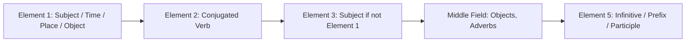
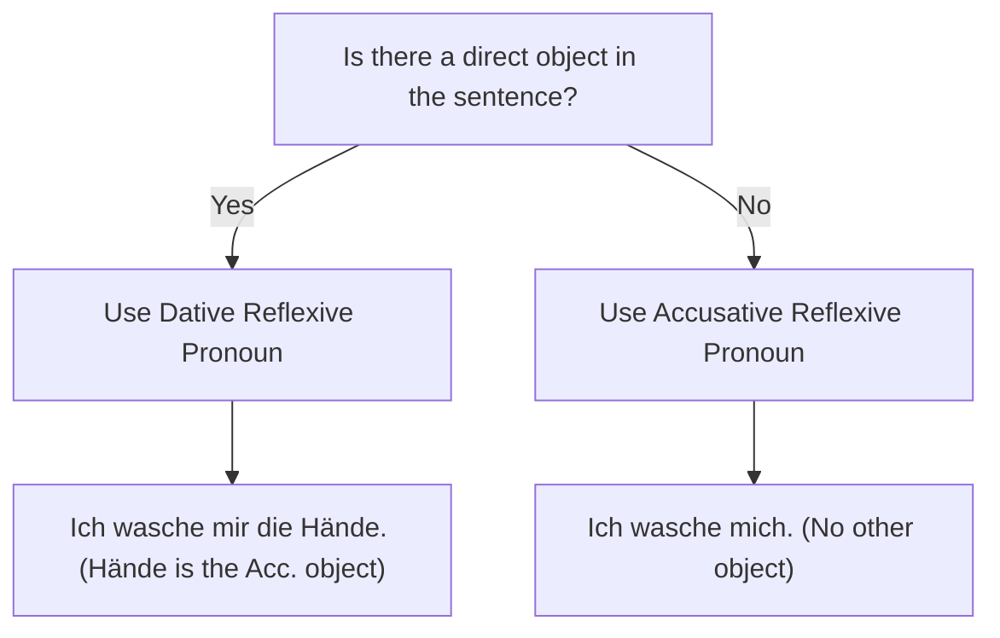

# Chapter 6: Core German Grammar (Grammatik)

German grammar is famous for its structure, precision, and inflection. To reach the B1 level, you must master the fundamental components: word order, the four grammatical cases, relative clauses, reflexive constructions, and the passive voice.

---

## 1. Word Order and Sentence Structure

German sentence structure is highly logical and governed by strict rules, most notably the position of the verb.

### A. The Verb-Second (V2) Rule in Main Clauses (Hauptsätze)
In a standard main clause, the conjugated verb must always be the **second element** in the sentence. Note that "second element" does not mean the second word; a single grammatical element can consist of multiple words.

* **Standard Order (Subject First)**:
  * *German*: Ich **gehe** heute mit meinen Freunden in den Park.
  * *English*: I am going to the park with my friends today.
* **Inverted Order (Time First)**: If you start a sentence with a time, place, or object to emphasize it, the subject must move to the third position (immediately after the verb) so the verb remains in the second position.
  * *German*: Heute **gehe** ich mit meinen Freunden in den Park. *(Today go I...)*
  * *German*: Mit meinen Freunden **gehe** ich heute in den Park. *(With my friends go I...)*

### B. Subordinate Clauses (Nebensätze)
In a subordinate clause (introduced by subordinating conjunctions like *weil*, *dass*, *wenn*, *ob*, *obwohl*, *da*), the conjugated verb is sent to the **very end** of the clause.
* *German*: Ich bleibe zu Hause, **weil** ich krank **bin**. *(I am staying home because I am sick.)*
* *German*: Er sagt, **dass** er morgen **kommt**. *(He says that he is coming tomorrow.)*

### C. Word Order for Objects: Pronouns vs. Nouns
When a sentence has both a Dative (indirect) and an Accusative (direct) object, their order depends on whether they are nouns or pronouns:
1. **Two Nouns**: Dative comes before Accusative.
   * *Example*: Ich gebe **dem Mann** (Dat) **den Brief** (Acc). *(I give the man the letter.)*
2. **Two Pronouns**: Accusative comes before Dative.
   * *Example*: Ich gebe **ihn** (Acc) **ihm** (Dat). *(I give it to him.)*
3. **One Noun & One Pronoun**: The pronoun always comes first.
   * *Example*: Ich gebe **ihn** (Acc pronoun) **dem Mann** (Dat noun).

### D. Adverbial Order: TeKaMoLo
When a sentence contains multiple adverbial expressions, they must follow the **TeKaMoLo** order:
1. **Te**mporal (When? / How long?)
2. **Ka**usal (Why?)
3. **Mo**dal (How? / By what means?)
4. **Lo**kal (Where? / Where to?)

* *Example*: Ich fahre **heute** (Te) **wegen des Regens** (Ka) **mit dem Auto** (Mo) **zur Arbeit** (Lo).

---

## 2. Nouns: Gender and Plurals

Every German noun has one of three grammatical genders:
* **Masculine**: *der* (e.g., *der Mann* — the man)
* **Feminine**: *die* (e.g., *die Frau* — the woman)
* **Neuter**: *das* (e.g., *das Kind* — the child)

### Gender Clues from Noun Endings
While you must learn the article with the noun, some suffixes are 100% reliable indicators of gender:

| Gender | Suffixes | Examples |
| :--- | :--- | :--- |
| **Masculine** | `-ismus`, `-ist`, `-er` (occupations), `-ismus` | der Optimismus, der Lehrer, der Kapitalismus |
| **Feminine** | `-ung`, `-heit`, `-keit`, `-schaft`, `-tät`, `-in` (occupations), `-ie` | die Zeitung, die Freiheit, die Universität, die Lehrerin |
| **Neuter** | `-chen`, `-lein`, `-ment`, `-um`, `Ge-...` (collective nouns) | das Mädchen, das Dokument, das Studium, das Gebäude |

---

## 3. The Four Cases (Die vier Fälle)

German uses cases to show the grammatical role of a noun or pronoun in a sentence.

### 1. Nominative (Nominativ)
The **subject** of the sentence (the person or thing performing the action).
* *Example*: **Der Hund** bellt. *(The dog barks.)*

### 2. Accusative (Akkusativ)
The **direct object** (the person or thing directly receiving the action).
* *Example*: Ich sehe **den Hund**. *(I see the dog.)*

### 3. Dative (Dativ)
The **indirect object** (the person or thing receiving the direct object, or the beneficiary of the action).
* *Example*: Ich gebe **dem Hund** einen Knochen. *(I give the dog a bone.)*

### 4. Genitive (Genitiv)
Indicates **possession** or belonging (equivalent to "of the" or "'s" in English).
* *Example*: Das Spielzeug **des Hundes**. *(The dog's toy.)*
* *Spelling Note*: Masculine and Neuter nouns in the Genitive singular must add **-s** (for multi-syllable words) or **-es** (for single-syllable words or words ending in -s, -z, -x, -ß). (e.g., *des Vaters*, *des Hauses*).

---

## Case Declension Table (Definite Articles)

Notice that only the **masculine** article changes in the Accusative case (*der* becomes *den*).

| Case | Masculine | Feminine | Neuter | Plural |
| :--- | :--- | :--- | :--- | :--- |
| **Nominative** | der | die | das | die |
| **Accusative** | den | die | das | die |
| **Dative** | dem | der | dem | den (+n on noun) |
| **Genitive** | des (+s) | der | des (+s) | der |

---

## 4. Relative Clauses (Relativsätze)

Relative clauses are subordinate clauses used to describe a noun in more detail. The relative pronoun must match the noun in **gender** and **number**, but its **case** is determined by its grammatical role inside the relative clause.

### Relative Pronouns Table
Relative pronouns are almost identical to definite articles, except for the Dative plural (*denen*) and Genitive forms.

| Case | Masculine | Feminine | Neuter | Plural |
| :--- | :--- | :--- | :--- | :--- |
| **Nominative** | der | die | das | die |
| **Accusative** | den | die | das | die |
| **Dative** | dem | der | dem | denen |
| **Genitive** | dessen | deren | dessen | deren |

### Examples:
* **Nominative (Subject in relative clause)**:
  * Der Mann, **der** dort steht, ist mein Vater. *(The man who is standing there is my father.)*
* **Accusative (Direct object in relative clause)**:
  * Der Mann, **den** ich gestern gesehen habe, ist mein Vater. *(The man whom I saw yesterday is my father.)*
* **Dative (Indirect object in relative clause)**:
  * Der Mann, **dem** ich das Buch gegeben habe, ist mein Vater. *(The man to whom I gave the book is my father.)*
* **Genitive (Possession in relative clause)**:
  * Der Mann, **dessen** Auto gestohlen wurde, ist mein Vater. *(The man whose car was stolen is my father.)*

---

## 5. Reflexive Verbs (Reflexive Verben)

Reflexive verbs require a reflexive pronoun that refers back to the subject. This pronoun can be in the **Accusative** or **Dative** case.

### Reflexive Pronouns Table
Notice that the pronouns are only different from personal pronouns in the 3rd person singular and plural (**sich**).

| Pronoun | Accusative | Dative | Example (Accusative) | Example (Dative) |
| :--- | :--- | :--- | :--- | :--- |
| **ich** | mich | mir | Ich beeile **mich**. | Ich kaufe **mir** ein Buch. |
| **du** | dich | dir | Du beeilst **dich**. | Du kaufst **dir** ein Buch. |
| **er/sie/es** | sich | sich | Er beeilt **sich**. | Er kauft **sich** ein Buch. |
| **wir** | uns | uns | Wir beeilen **uns**. | Wir kaufen **uns** ein Buch. |
| **ihr** | euch | euch | Ihr beeilt **euch**. | Ihr kauft **euch** ein Buch. |
| **sie/Sie** | sich | sich | Sie beeilen **sich**. | Sie kaufen **sich** ein Buch. |

---

## 6. The Passive Voice (Das Passiv)

German has two types of passive voice: **Vorgangspassiv** (Process Passive - "something is being done") and **Zustandspassiv** (State Passive - "something is done/completed").

### 1. Vorgangspassiv (Process Passive)
Focuses on the action itself.
* **Present Tense Formula**: `werden (conjugated) + ... + Past Participle`
* **Simple Past Formula**: `wurden (conjugated) + ... + Past Participle`

* *Active*: Der Mann repariert das Auto. *(The man is repairing the car.)*
* *Passive (Present)*: Das Auto **wird** (von dem Mann) **repariert**. *(The car is being repaired [by the man].)*
* *Passive (Past)*: Das Auto **wurde** **repariert**. *(The car was repaired.)*

### 2. Zustandspassiv (State Passive)
Focuses on the final state resulting from an action.
* **Formula**: `sein (conjugated) + ... + Past Participle`

* *Example*: Die Tür ist geöffnet. *(The door is open / has been opened.)*
