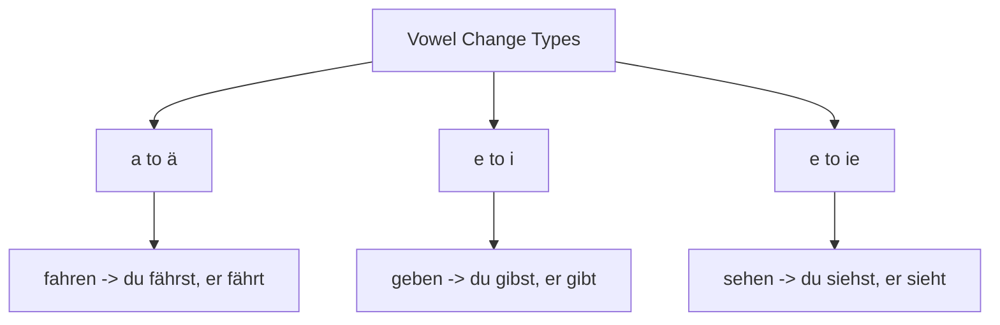

# Chapter 7: Master Verb Conjugation (Verbkonjugation)

Verbs are the engine of the German sentence. To communicate effectively, you must understand how German verbs are categorized and how their stems and endings change.

---

## 1. The Anatomy of a German Verb

Every German verb in its dictionary form (Infinitive) consists of a **stem** and an **ending** (almost always **-en** or **-n**).

* **gehen** (to go) -> **geh-** (stem) + **-en** (ending)
* **machen** (to make/do) -> **mach-** (stem) + **-en** (ending)
* **handeln** (to act) -> **handel-** (stem) + **-n** (ending)

To conjugate a verb in the present tense, you remove the infinitive ending (**-en**) and add the **personal endings** corresponding to the subject.

---

## 2. Regular (Weak) Verb Conjugation

Weak verbs (schwache Verben) follow a strict, predictable pattern. Their stem vowel never changes.

### Present Tense Endings (Präsens)

| Pronoun | Ending | Example: **machen** (stem: *mach-*) |
| :--- | :--- | :--- |
| **ich** | **-e** | ich mach**e** (I do) |
| **du** | **-st** | du mach**st** (you do) |
| **er / sie / es** | **-t** | er mach**t** (he does) |
| **wir** | **-en** | wir mach**en** (we do) |
| **ihr** | **-t** | ihr mach**t** (you all do) |
| **sie / Sie** | **-en** | sie mach**en** (they/you formal do) |

> [!NOTE]
> If a verb stem ends in **-d** or **-t** (e.g., *arbeiten*, *finden*), an extra **-e-** is inserted before the endings **-st** and **-t** to make pronunciation possible:
> * du arbeit**est** (not *arbeitst*)
> * er arbeit**et** (not *arbeitt*)

---

## 3. Strong (Irregular) Verbs and Stem Changes

Strong verbs (starke Verben) often undergo a **vowel shift** in their stem, but only in the **second person singular (du)** and **third person singular (er/sie/es)**. The plural forms (*wir*, *ihr*, *sie/Sie*) remain regular.

### Common Vowel Changes in the Present Tense:
1. **a** changes to **ä**
   * **fahren** (to drive) -> ich fahre, **du fährst**, **er fährt**
2. **e** changes to **i**
   * **geben** (to give) -> ich gebe, **du gibst**, **er gibt**
3. **e** changes to **ie**
   * **sehen** (to see) -> ich sehe, **du siehst**, **er sieht**

---

## 4. Separable and Inseparable Verbs

German verbs can take prefixes that alter their meaning. These prefixes are either **separable** or **inseparable**.

### Separable Verbs (Trennbare Verben)
The prefix detaches from the verb and moves to the **very end** of the clause in the present tense.
* **einkaufen** (to shop) = *ein-* (prefix) + *kaufen* (to buy)
  * *German*: Ich **kaufe** im Supermarkt **ein**. (I shop in the supermarket.)
* **anrufen** (to call) = *an-* (prefix) + *rufen* (to call)
  * *German*: Sie **ruft** morgen **an**. (She is calling tomorrow.)

*Common separable prefixes*: *ab-*, *an-*, *auf-*, *aus-*, *ein-*, *mit-*, *vor-*, *zu-*.

### Inseparable Verbs (Untrennbare Verben)
The prefix stays attached to the verb at all times.
* **verstehen** (to understand)
  * *German*: Ich **verstehe** das nicht. (I don't understand that.)

*Common inseparable prefixes*: *be-*, *emp-*, *ent-*, *er-*, *ge-*, *miss-*, *ver-*, *zer-*.

---

## 5. Reflexive Verbs (Reflexive Verben)

Reflexive verbs require a reflexive pronoun that refers back to the subject (like "myself" or "himself").

* **sich waschen** (to wash oneself)
  * Ich wasche **mich**. (I wash myself.)
  * Du wäschst **dich**. (You wash yourself.)
  * Er wäscht **sich**. (He washes himself.)
