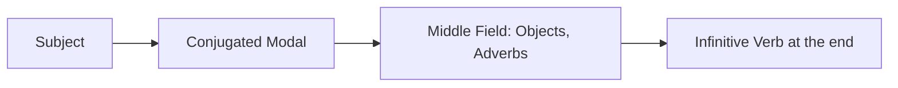

# Chapter 10: Modal Verbs (Modalverben)

Modal verbs are verbs that modify the meaning of another verb by expressing ability, permission, obligation, necessity, desire, or probability. In German, there are six modal verbs: **können**, **müssen**, **dürfen**, **wollen**, **sollen**, and **mögen**. Additionally, the conditional form **möchten** (would like) functions syntactically as a modal verb.

To reach a B1 level, you must master not only their present-tense conjugations but also their past tenses, subjunctive forms, syntax in subordinate clauses, and the advanced **Double Infinitive** construction in the Perfect tense.

---

## 1. Syntax and Word Order of Modal Verbs

Modal verbs always require a secondary verb in the **infinitive** form to complete their meaning (except when the action is obvious from the context, e.g., *Ich muss nach Hause [gehen]*).

### A. Main Clauses (Hauptsätze)
In a simple main clause, the conjugated modal verb occupies the **second position** (V2). The main action verb is placed in its **infinitive** form at the **very end** of the sentence.

* **Present**: Ich **kann** heute Abend nicht **kommen**. *(I cannot come tonight.)*
* **Simple Past**: Ich **konnte** gestern nicht **kommen**. *(I could not come yesterday.)*

### B. Subordinate Clauses (Nebensätze)
In a subordinate clause (introduced by *weil*, *dass*, *wenn*, etc.), the conjugated modal verb goes to the **very end**, directly following the infinitive.
* **Present**: Ich bleibe zu Hause, weil ich noch Hausaufgaben machen **muss**. *(I am staying home because I still have to do homework.)*

### C. The Double Infinitive in the Perfect Tense (Doppelinfinitiv)
This is a critical B1-level grammatical structure. When a modal verb is used in the **Perfect** or **Past Perfect** tense alongside a main verb, it does **not** use its past participle (e.g., *gekonnt*, *gemusst*). Instead, it uses its **infinitive** form. This results in two infinitives standing next to each other at the end of the sentence.

* **Formula**: `haben (conjugated) + ... + [Main Verb Infinitive] + [Modal Verb Infinitive]`

* *Incorrect*: Ich habe das nicht machen *gemusst*.
* *Correct*: Ich habe das nicht machen **müssen**. *(I did not have to do that.)*
* *Correct*: Er hat nicht kommen **können**. *(He was not able to come.)*

> [!IMPORTANT]
> **Subordinate Clauses with Double Infinitive**: In a subordinate clause, the conjugated auxiliary **haben** cannot go to the very end. Instead, it must be placed **immediately before** the two infinitives.
> * *Correct*: Ich weiß, dass er hat kommen **können**. *(I know that he was able to come.)*

---

## 2. Deep Dive: The Six Modal Verbs

---

### 1. können (to be able to / can / may)
* **Meaning**: Expresses physical ability, learned skills, or objective possibility.
* **Subjunctive II (Könnte)**: Used for polite requests ("could") or hypothetical ability.

#### Conjugation Table
| Pronoun | Present (Präsens) | Simple Past (Präteritum) | Subjunctive II (Konjunktiv II) | Past Participle |
| :--- | :--- | :--- | :--- | :--- |
| **ich** | kann | konnte | könnte | gekonnt |
| **du** | kannst | konntest | könntest | gekonnt |
| **er/sie/es** | kann | konnte | könnte | gekonnt |
| **wir** | können | konnten | könnten | gekonnt |
| **ihr** | könnt | konntet | könntet | gekonnt |
| **sie/Sie** | können | konnten | könnten | gekonnt |

#### Example Sentences
1. Ich **kann** schwimmen, seit ich sechs Jahre alt bin. *(I can swim since I was six years old.)*
2. **Kannst** du mir bitte das Salz reichen? *(Can you please pass me the salt?)*
3. Gestern **konnte** ich wegen des Regens nicht Fußball spielen. *(Yesterday I couldn't play soccer because of the rain.)*
4. **Könnten** Sie mir helfen, diesen Koffer zu tragen? *(Could you help me carry this suitcase? - Polite)*
5. Wenn ich mehr Geld hätte, **könnte** ich ein neues Auto kaufen. *(If I had more money, I could buy a new car.)*
6. Er hat die Aufgabe nicht alleine lösen **können**. *(He wasn't able to solve the task alone. - Double Infinitive)*
7. Wir **können** morgen ins Kino gehen, wenn du Zeit hast. *(We can go to the cinema tomorrow if you have time.)*
8. **Kann** man hier mit Kreditkarte bezahlen? *(Can one pay with a credit card here?)*
9. Sie **können** Deutsch sehr gut verstehen. *(They can understand German very well.)*
10. Ich **konnte** die ganze Nacht vor Aufregung nicht schlafen. *(I couldn't sleep all night because of excitement.)*

---

### 2. müssen (to have to / must)
* **Meaning**: Expresses an absolute necessity, physical law, or strong internal/external obligation.
* **Subjunctive II (Müsste)**: Expresses a strong probability or assumption ("should really").

#### Conjugation Table
| Pronoun | Present (Präsens) | Simple Past (Präteritum) | Subjunctive II (Konjunktiv II) | Past Participle |
| :--- | :--- | :--- | :--- | :--- |
| **ich** | muss | musste | müsste | gemusst |
| **du** | musst | musstest | müsstest | gemusst |
| **er/sie/es** | muss | musste | müsste | gemusst |
| **wir** | müssen | mussten | müssten | gemusst |
| **ihr** | müsst | musstet | müsstet | gemusst |
| **sie/Sie** | müssen | mussten | müssten | gemusst |

#### Example Sentences
1. Ich **muss** jeden Morgen um sechs Uhr aufstehen. *(I have to get up at six o'clock every morning.)*
2. Jeder Staatsbürger **muss** Steuern zahlen. *(Every citizen must pay taxes.)*
3. Wegen des Unfalls **mussten** wir einen Umweg fahren. *(Because of the accident, we had to drive a detour.)*
4. Du **müsstest** eigentlich bald fertig sein. *(You should actually be finished soon. - Probability)*
5. Wir haben gestern lange arbeiten **müssen**. *(We had to work long hours yesterday. - Double Infinitive)*
6. Ich **muss** unbedingt abnehmen. *(I absolutely must lose weight. - Internal obligation)*
7. Pflanzen **müssen** Wasser haben, um zu wachsen. *(Plants must have water to grow.)*
8. In Deutschland **muss** man auf der rechten Straßenseite fahren. *(In Germany, one must drive on the right side of the street.)*
9. Ich **musste** meine Pläne kurzfristig ändern. *(I had to change my plans on short notice.)*
10. Er **muss** sehr müde sein, er schläft schon seit zehn Stunden. *(He must be very tired; he has been sleeping for ten hours.)*

> [!WARNING]
> **müssen nicht vs. dürfen nicht**:
> * **müssen nicht** means "don't have to" (lack of obligation). E.g., *Du musst nicht kommen* = You don't have to come.
> * **dürfen nicht** means "must not / are not allowed to" (prohibition). E.g., *Du darfst nicht kommen* = You must not come.

---

### 3. dürfen (to be allowed to / may)
* **Meaning**: Expresses permission, authority, or a right granted by someone else. When negated (*nicht dürfen*), it expresses prohibition.
* **Subjunctive II (Dürfte)**: Expresses a cautious probability ("is likely to").

#### Conjugation Table
| Pronoun | Present (Präsens) | Simple Past (Präteritum) | Subjunctive II (Konjunktiv II) | Past Participle |
| :--- | :--- | :--- | :--- | :--- |
| **ich** | darf | durfte | dürfte | gedurft |
| **du** | darfst | durftest | dürftest | gedurft |
| **er/sie/es** | darf | durfte | dürfte | gedurft |
| **wir** | dürfen | durften | dürften | gedurft |
| **ihr** | dürft | durftet | dürftet | gedurft |
| **sie/Sie** | dürfen | durften | dürften | gedurft |

#### Example Sentences
1. **Darf** ich hier mein Auto parken? *(May I park my car here?)*
2. Kinder **dürfen** heute länger aufbleiben. *(Children are allowed to stay up longer today.)*
3. Im Museum **darf** man keine Fotos machen. *(One is not allowed to take photos in the museum. - Prohibition)*
4. Das **dürfte** kein großes Problem sein. *(That shouldn't be a big problem. - Probability)*
5. Wir haben als Kinder kein Eis vor dem Essen essen **dürfen**. *(As children, we weren't allowed to eat ice cream before dinner.)*
6. Hier **darf** man nicht rauchen. *(Smoking is not allowed here.)*
7. Mit achtzehn Jahren **darf** man in Deutschland wählen. *(At eighteen years old, one is allowed to vote in Germany.)*
8. **Dürfte** ich Sie kurz stören? *(May I disturb you for a moment? - Polite)*
9. Sie **durften** während der Prüfung keine Wörterbücher benutzen. *(They were not allowed to use dictionaries during the exam.)*
10. Mein Arzt sagt, ich **darf** keinen Kaffee mehr trinken. *(My doctor says I am not allowed to drink coffee anymore.)*

---

### 4. wollen (to want to / intend to)
* **Meaning**: Expresses a strong desire, plan, or firm intention.
* **Subjunctive II (Wollte)**: Practically identical to Simple Past; rarely used for politeness because *möchten* is used instead.

#### Conjugation Table
| Pronoun | Present (Präsens) | Simple Past (Präteritum) | Subjunctive II (Konjunktiv II) | Past Participle |
| :--- | :--- | :--- | :--- | :--- |
| **ich** | will | wollte | wollte | gewollt |
| **du** | willst | wolltest | wolltest | gewollt |
| **er/sie/es** | will | wollte | wollte | gewollt |
| **wir** | wollen | wollten | wollten | gewollt |
| **ihr** | wollt | wolltet | wolltet | gewollt |
| **sie/Sie** | wollen | wollten | wollten | gewollt |

#### Example Sentences
1. Ich **will** nächstes Jahr ein neues Auto kaufen. *(I want to buy a new car next year. - Firm intention)*
2. **Willst** du heute Abend mit uns ins Kino gehen? *(Do you want to go to the cinema with us tonight?)*
3. Er **wollte** den Vertrag nicht unterschreiben. *(He did not want to sign the contract.)*
4. Wir haben den Termin nicht verschieben **wollen**. *(We did not want to postpone the appointment.)*
5. Sie **wollen** im Sommer nach Italien reisen. *(They want to travel to Italy in the summer.)*
6. Ich **wollte** dich gerade anrufen! *(I was just about to call you! - Intent)*
7. Warum **willst** du mir nicht helfen? *(Why don't you want to help me?)*
8. Er **will** später Ingenieur werden. *(He wants to become an engineer later.)*
9. Meine Eltern **wollten** nie ein Haustier haben. *(My parents never wanted to have a pet.)*
10. Wir **wollen** hoffen, dass alles gut geht. *(We want to hope that everything goes well.)*

---

### 5. sollen (should / supposed to)
* **Meaning**: Expresses an obligation based on someone else's will, a duty, a moral command, or advice.
* **Subjunctive II (Sollte)**: Used to give advice or recommendations ("should").

#### Conjugation Table
| Pronoun | Present (Präsens) | Simple Past (Präteritum) | Subjunctive II (Konjunktiv II) | Past Participle |
| :--- | :--- | :--- | :--- | :--- |
| **ich** | soll | sollte | sollte | gesollt |
| **du** | sollst | solltest | solltest | gesollt |
| **er/sie/es** | soll | sollte | sollte | gesollt |
| **wir** | sollen | sollten | sollten | gesollt |
| **ihr** | sollt | solltet | solltet | gesollt |
| **sie/Sie** | sollen | sollten | sollten | gesollt |

#### Example Sentences
1. Der Arzt sagt, ich **soll** im Bett bleiben. *(The doctor says I should stay in bed. - Someone else's instruction)*
2. Kinder **sollen** ihren Eltern gehorchen. *(Children are supposed to obey their parents. - Duty)*
3. Was **soll** ich heute kochen? *(What am I supposed to cook today?)*
4. Du **solltest** mehr Gemüse essen. *(You should eat more vegetables. - Advice)*
5. Wir haben die Hausaufgaben bis heute fertigmachen **sollen**. *(We were supposed to finish the homework by today.)*
6. Man **soll** nicht lügen. *(One should not lie. - Moral rule)*
7. Ich **soll** dir schöne Grüße von meiner Schwester ausrichten. *(I am supposed to give you warm greetings from my sister.)*
8. Wo **sollen** wir uns heute Abend treffen? *(Where are we supposed to meet tonight?)*
9. Du **solltest** dich bei ihr entschuldigen. *(You should apologize to her. - Recommendation)*
10. Er **soll** ein sehr reicher Mann sein. *(He is said to be a very rich man. - Rumor/Hear-say)*

---

### 6. mögen (to like)
* **Meaning**: In the present tense, it indicates a liking for a person, food, or thing. In B1 German, its subjunctive form **möchten** is treated as a separate modal verb meaning "would like".

#### Conjugation Table
| Pronoun | Present (Präsens) | Simple Past (Präteritum) | Subjunctive II (Möchten) | Past Participle |
| :--- | :--- | :--- | :--- | :--- |
| **ich** | mag | mochte | möchte | gemocht |
| **du** | magst | mochtest | möchtest | gemocht |
| **er/sie/es** | mag | mochte | möchte | gemocht |
| **wir** | mögen | mochten | möchten | gemocht |
| **ihr** | mögt | mochtet | möchtet | gemocht |
| **sie/Sie** | mögen | mochten | möchten | gemocht |

#### Example Sentences
1. Ich **mag** keine Oliven. *(I do not like olives.)*
2. **Magst** du klassische Musik? *(Do you like classical music?)*
3. Als Kind **mochte** ich keinen Spinat. *(As a child, I didn't like spinach.)*
4. Ich **möchte** bitte einen Kaffee bestellen. *(I would like to order a coffee, please. - Polite wish)*
5. Was **möchten** Sie essen? *(What would you like to eat? - Formal)*
6. Er hat diesen Lehrer noch nie **gemocht**. *(He has never liked this teacher. - Used as a main verb)*
7. Wir **mögen** es, wenn es im Winter schneit. *(We like it when it snows in winter.)*
8. **Möchtest** du mit mir spazieren gehen? *(Would you like to go for a walk with me?)*
9. Sie **möchten** gerne die Rechnung bezahlen. *(They would like to pay the bill.)*
10. Niemand **mag** unhöfliche Menschen. *(Nobody likes rude people.)*
