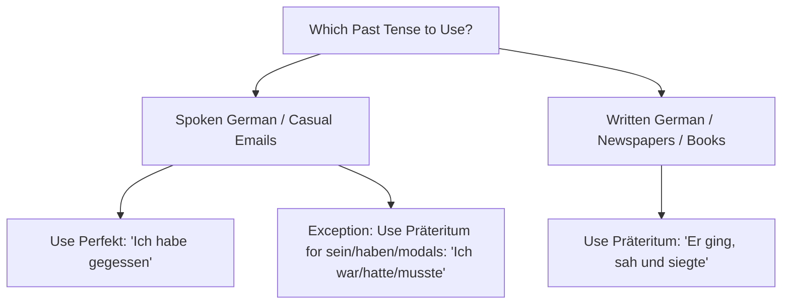

# Chapter 11: The German Tense System (Die Zeitformen)

German has six grammatical tenses. To reach the B1/B2 level, you must understand not only how to form these tenses in the **active voice**, but also how they function in the **passive voice**, and how to use the **subjunctive mood** (Konjunktiv I and Konjunktiv II) to express indirect speech, wishes, and hypothetical scenarios.

---

## 1. Overview of the Six German Tenses

| Tense | German Name | Usage | Formation Formula |
| :--- | :--- | :--- | :--- |
| **Present** | Präsens | Current actions, timeless facts, future plans | `Verb Stem + Present Endings` |
| **Present Perfect** | Perfekt | Spoken past, conversational narration | `haben/sein (Present) + Past Participle` |
| **Simple Past** | Präteritum | Written past, novels, newspapers, modals/auxiliaries | `Verb Stem + Past Endings` |
| **Past Perfect** | Plusquamperfekt | Actions completed before another past action | `haben/sein (Simple Past) + Past Participle` |
| **Future I** | Futur I | Future plans, assumptions, promises | `werden (Present) + Infinitive` |
| **Future II** | Futur II | Completed future actions, past assumptions | `werden (Present) + Past Participle + haben/sein` |

---

## 2. Present Tense (Präsens)
Used for:
1. Actions happening right now: *Ich lerne Deutsch.* (I am learning German.)
2. Facts and permanent states: *Berlin ist die Hauptstadt von Deutschland.* (Berlin is the capital of Germany.)
3. Scheduled future actions: *Morgen fliege ich nach London.* (Tomorrow I am flying to London.)

---

## 3. Past Tenses: Perfekt vs. Präteritum

In German, there is no difference in meaning between the Present Perfect (*Perfekt*) and the Simple Past (*Präteritum*) like there is in English (e.g., "I have eaten" vs. "I ate"). The difference is purely **stylistic**.

### Formulating the Present Perfect (Perfekt)
* **Formula**: `haben / sein (conjugated in Present) + Past Participle (at the end)`

#### When to use *sein* as the auxiliary:
1. **Movement**: Verbs indicating a change of location from A to B (e.g., *gehen*, *kommen*, *fahren*, *fliegen*, *laufen*, *reisen*).
2. **Change of State**: Verbs indicating a transition from one state of being to another (e.g., *sterben* - to die, *einschlafen* - to fall asleep, *aufwachen* - to wake up, *werden* - to become).
3. **Exceptions**: *sein* (to be) -> *ist gewesen*; *bleiben* (to stay) -> *ist geblieben*; *passieren* (to happen) -> *ist passiert*.

All other verbs (including all transitive verbs that take an Accusative object, and all reflexive verbs) use **haben**.

---

## 4. Past Perfect (Plusquamperfekt)
Used to describe an action that occurred **before** another action in the past. It is almost always used in combination with a Simple Past clause introduced by **nachdem** (after).

* **Formula**: `haben / sein (conjugated in Simple Past) + Past Participle`
  * *haben* in Simple Past -> **hatte, hattest, hatte, hatten, hattet, hatten**
  * *sein* in Simple Past -> **war, warst, war, waren, wart, waren**

* *Example*: **Nachdem** ich meine Hausaufgaben **gemacht hatte** (Plusquamperfekt), **ging** ich spazieren (Präteritum).
  *(After I had done my homework, I went for a walk.)*

---

## 5. Future Tenses

### Future I (Futur I)
Used to express a future plan, a promise, or an assumption about the present.
* **Formula**: `werden (conjugated in Present) + Infinitive (at the end)`
* *Example (Plan)*: Ich **werde** morgen das Auto **waschen**. *(I will wash the car tomorrow.)*
* *Example (Assumption)*: Er ist nicht da. Er **wird** wohl im Büro **sein**. *(He isn't here. He is probably in the office.)*

### Future II (Futur II)
Used to describe an action that will be completed by a specific point in the future, or an assumption about a past event.
* **Formula**: `werden (conjugated in Present) + Past Participle + haben / sein (infinitive)`
* *Example (Completed Future)*: Bis morgen Abend **werde** ich die Hausaufgaben **gemacht haben**. *(By tomorrow evening, I will have done the homework.)*
* *Example (Past Assumption)*: Er kommt nicht. Er **wird** den Bus **verpasst haben**. *(He isn't coming. He must have missed the bus.)*

---

## 6. The Subjunctive II (Konjunktiv II)

The Konjunktiv II is used for:
1. **Hypothetical situations** (Unreal conditions): *Wenn ich reich wäre, würde ich ein Haus kaufen.*
2. **Polite requests**: *Könnten Sie mir bitte helfen?*
3. **Wishes/Dreams**: *Hätte ich doch nur mehr Zeit!*

### Formation: Present Conditional
For most verbs, use the auxiliary **würden** + the infinitive at the end.
* **Formula**: `würden (conjugated) + ... + Infinitive`
  * *würde, würdest, würde, würden, würdet, würden*
  * *Example*: Ich **würde** gerne nach Japan **reisen**. *(I would like to travel to Japan.)*

For high-frequency verbs, auxiliaries, and modals, use their dedicated Konjunktiv II form (usually the Simple Past form with an Umlaut):
* **haben** -> **hätte** *(would have)*
* **sein** -> **wäre** *(would be)*
* **können** -> **könnte** *(could / would be able to)*
* **müssen** -> **müsste** *(would have to)*
* **dürfen** -> **dürfte** *(would be allowed to)*

### Formation: Past Conditional (Unreal Past)
To express what *would have happened* in the past (but didn't), use the Konjunktiv II forms of *haben* or *sein* as auxiliaries.
* **Formula**: `hätte / wäre (conjugated) + ... + Past Participle`
* *Example*: Wenn ich gelernt hätte, **wäre** ich nicht durch die Prüfung **gefallen**.
  *(If I had studied, I wouldn't have failed the exam.)*
* *Example*: Ich **hätte** dich **angerufen**, wenn ich deine Nummer gehabt hätte.
  *(I would have called you if I had had your number.)*

---

## 7. Passive Voice in All Tenses (Vorgangspassiv)

The process passive (*Vorgangspassiv*) is formed using the auxiliary **werden** and the **Past Participle**. Here is how it declines through the tenses:

| Tense | Active Example | Passive Translation | Passive Formula |
| :--- | :--- | :--- | :--- |
| **Present** | Er baut das Haus. | Das Haus **wird gebaut**. | `werden (Present) + Participle` |
| **Simple Past** | Er baute das Haus. | Das Haus **wurde gebaut**. | `werden (Past) + Participle` |
| **Perfect** | Er hat das Haus gebaut. | Das Haus **ist gebaut worden**. | `sein (Present) + Participle + worden` |
| **Past Perfect**| Er hatte das Haus gebaut.| Das Haus **war gebaut worden**. | `sein (Past) + Participle + worden` |
| **Future I** | Er wird das Haus bauen. | Das Haus **wird gebaut werden**. | `werden (Present) + Participle + werden` |

> [!NOTE]
> In the Perfect and Past Perfect Passive, the past participle of *werden* (*geworden*) loses its *ge-* prefix and becomes **worden** when combined with another past participle.
