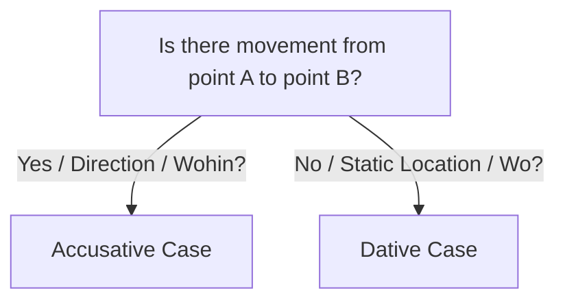

# Chapter 12: German Prepositions (Präpositionen)

Prepositions are words that show the relationship between a noun (or pronoun) and other words in a sentence. In German, every preposition dictates the grammatical **case** of the noun that follows it. To reach the B1 level, you must master:
1. Accusative, Dative, and Genitive prepositions.
2. Two-way prepositions (*Wechselpräpositionen*) and their associated verb pairs.
3. **Verbs with fixed prepositions** (e.g., *warten auf*, *sich freuen über*).
4. **Prepositional adverbs** (da-compounds and wo-compounds, e.g., *darauf*, *worüber*).

---

## 1. Accusative Prepositions (Akkusativpräpositionen)

The nouns following these prepositions must always be in the **Accusative** case.

* **bis** (until, up to)
* **durch** (through)
* **entlang** (along - *placed after the noun*)
  * *Example*: den Fluss **entlang** *(along the river)*
* **für** (for)
* **gegen** (against, around/approximately)
* **ohne** (without)
* **um** (around, at [time])

> [!TIP]
> Memory Trick (Acronym): **DOG FUD**
> * **D**urch, **O**hne, **G**egen, **F**ür, **U**m, **D**urch (or *bis* / *entlang*).

### Examples:
* Das Geschenk ist für **dich** (Accusative). *(The gift is for you.)*
* Wir gehen durch **den Wald** (Accusative masculine). *(We are walking through the forest.)*
* Er fährt gegen **einen Baum** (Accusative masculine). *(He drives against a tree.)*

---

## 2. Dative Prepositions (Dativpräpositionen)

The nouns following these prepositions must always be in the **Dative** case.

* **ab** (from [time/point] onwards)
* **aus** (out of, from [origin])
* **bei** (at, near, with, at the home of)
* **mit** (with, by [transport])
* **nach** (after, to [cities/countries], according to)
* **seit** (since, for [duration])
* **von** (from, of)
* **zu** (to [people/places inside a city])

### Examples:
* Ich wohne bei **meinen Eltern** (Dative plural). *(I live with my parents.)*
* Er fährt mit **dem Zug** (Dative masculine). *(He travels by train.)*
* Ich gehe zu **der Bäckerei** / **zur Bäckerei** (Dative feminine). *(I am going to the bakery.)*
* Sie kommt aus **der Schweiz** (Dative feminine). *(She comes from Switzerland.)*

---

## 3. Two-Way Prepositions (Wechselpräpositionen)

These nine prepositions can take **either** the Accusative or the Dative case, depending on whether the sentence describes a **direction/movement** or a **static location**.

```
an (on/at side)  |  auf (on top of)  |  hinter (behind)
in (in/into)     |  neben (next to)  |  über (above/over)
unter (under)    |  vor (in front of) |  zwischen (between)
```



### The Rule: Location vs. Direction
* **Dative (Wo? - Where?)**: Used when describing a static location or activity within a set boundary (no movement from one place to another).
  * *German*: Das Buch liegt **auf dem Tisch** (Dative). *(The book is lying on the table.)*
* **Accusative (Wohin? - Where to?)**: Used when describing movement, direction, or transition from one place to another.
  * *German*: Ich lege das Buch **auf den Tisch** (Accusative). *(I lay the book onto the table.)*

### High-Frequency Verb Pairs
German has specific verbs that pair with these concepts. The action verb (Accusative) is always regular/weak, while the state verb (Dative) is strong/irregular.

| Action (Accusative / Movement) | State (Dative / Static) |
| :--- | :--- |
| **legen** (to lay down) | **liegen** (to lie) |
| **stellen** (to place upright) | **stehen** (to stand) |
| **setzen** (to set/seat) | **sitzen** (to sit) |
| **hängen** (to hang up) | **hängen** (to be hanging) |

* *Accusative*: Ich **stelle** die Vase **auf den Tisch**. *(I place the vase on the table.)*
* *Dative*: Die Vase **steht** **auf dem Tisch**. *(The vase is standing on the table.)*

---

## 4. Genitive Prepositions (Genitivpräpositionen)

These prepositions require the **Genitive** case. They are more common in written and formal German.

* **statt** / **anstelle** (instead of)
* **trotz** (despite)
* **während** (during)
* **wegen** (because of)
* **außerhalb** (outside of)
* **innerhalb** (inside of)

### Examples:
* Wegen **des Regens** (Genitive) bleiben wir zu Hause. *(Because of the rain, we are staying at home.)*
* Während **des Unterrichts** (Genitive) darf man nicht essen. *(During the lesson, one is not allowed to eat.)*
* Trotz **seiner Krankheit** (Genitive) kam er zur Arbeit. *(Despite his illness, he came to work.)*

---

## 5. Verbs with Fixed Prepositions (Verben mit festen Präpositionen)

In German, many verbs are paired with a specific preposition, and that preposition dictates the case. You must memorize these pairings. This is one of the most important vocabulary-building topics for B1.

### A. Verbs followed by Accusative Prepositions
* **warten auf (+ Akkusativ)**: To wait for.
  * *Example*: Ich warte **auf den Bus**. *(I am waiting for the bus.)*
* **sich freuen auf (+ Akkusativ)**: To look forward to (future event).
  * *Example*: Ich freue mich **auf den Urlaub**. *(I am looking forward to the vacation.)*
* **sich freuen über (+ Akkusativ)**: To be happy about (present/past event).
  * *Example*: Ich freue mich **über das Geschenk**. *(I am happy about the gift.)*
* **denken an (+ Akkusativ)**: To think of.
  * *Example*: Ich denke oft **an meine Familie**. *(I often think of my family.)*
* **sich interessieren für (+ Akkusativ)**: To be interested in.
  * *Example*: Sie interessiert sich **für Kunst**. *(She is interested in art.)*
* **bitten um (+ Akkusativ)**: To ask for / request.
  * *Example*: Er bittet **um Hilfe**. *(He asks for help.)*
* **sich bewerben um (+ Akkusativ)**: To apply for (a job).
  * *Example*: Ich bewerbe mich **um die Stelle**. *(I am applying for the job.)*

### B. Verbs followed by Dative Prepositions
* **träumen von (+ Dativ)**: To dream of.
  * *Example*: Ich träume **von einem großen Haus**. *(I dream of a big house.)*
* **teilnehmen an (+ Dativ)**: To participate in.
  * *Example*: Er nimmt **am Seminar** teil. *(He is participating in the seminar.)*
* **telefonieren mit (+ Dativ)**: To talk on the phone with.
  * *Example*: Ich telefoniere **mit meiner Mutter**. *(I am talking on the phone with my mother.)*
* **arbeiten an (+ Dativ)**: To work on.
  * *Example*: Sie arbeitet **an einem Projekt**. *(She is working on a project.)*
* **einladen zu (+ Dativ)**: To invite to.
  * *Example*: Ich lade dich **zu meiner Party** ein. *(I invite you to my party.)*

---

## 6. Prepositional Adverbs (Da- und Wo-Komposita)

When referring to things or concepts (not people) using a verb with a fixed preposition, German uses **da-compounds** (there-compounds) and **wo-compounds** (where-compounds).

### A. Da-Compounds (da- + preposition)
If the preposition starts with a vowel, insert an **-r-** (e.g., *darauf*, *darüber*, *daran*).
* **Person (Use normal pronoun)**:
  * Ich warte auf **meine Schwester** -> Ich warte auf **sie**. *(I am waiting for her.)*
* **Thing (Use da-compound)**:
  * Ich warte auf **den Bus** -> Ich warte **darauf**. *(I am waiting for it.)*

### B. Wo-Compounds (wo- + preposition)
Used for asking questions about things. If the preposition starts with a vowel, insert an **-r-** (e.g., *worauf*, *worüber*, *woran*).
* **Person (Use "Wer" in correct case)**:
  * **Auf wen** wartest du? — Ich warte auf meinen Vater. *(Who are you waiting for?)*
* **Thing (Use wo-compound)**:
  * **Worauf** wartest du? — Ich warte auf den Bus. *(What are you waiting for?)*
