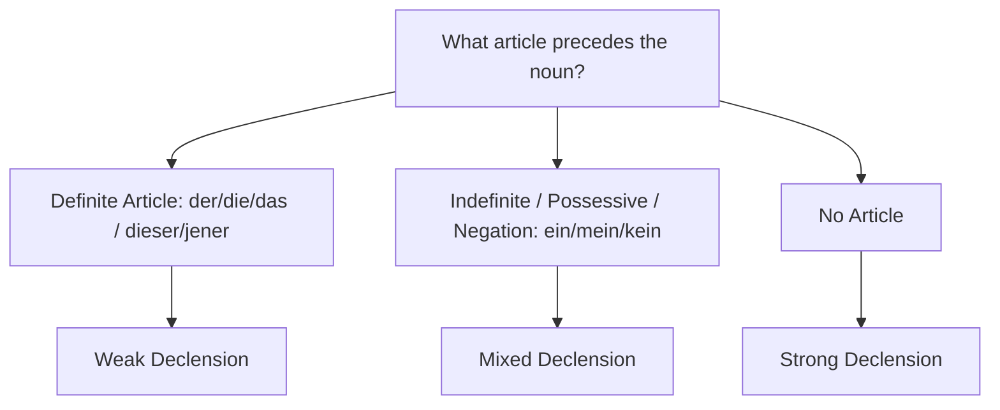

# Chapter 13: Adjectives (Adjektive)

Adjectives describe the qualities of nouns. In German, adjectives are declined (i.e., they take ending suffixes) only when they are placed **before** the noun they modify (attributive position). If they are placed **after** the verb (predicative position), they do not take any endings.

* **Attributive (declined)**: Das ist ein **schönes** Haus. *(This is a beautiful house.)*
* **Predicative (not declined)**: Das Haus ist **schön**. *(The house is beautiful.)*

To reach the B1 level, you must master:
1. The three types of adjective declension: **Weak**, **Mixed**, and **Strong**.
2. Comparative and Superlative forms and their declensions.
3. Adjectives with fixed prepositions (e.g., *stolz auf*, *zufrieden mit*).

---

## 1. Adjective Declension (Adjektivdeklination)

The ending an adjective takes depends on the word that precedes it.

---

### A. Weak Declension (After Definite Articles: *der, die, das*, etc.)
Used when the gender and case of the noun are already clearly indicated by a definite article or a determining pronoun (like *dieser*, *jener*, *jeder*). The endings are simple: they are either **-e** or **-en**.

| Case | Masculine | Feminine | Neuter | Plural |
| :--- | :--- | :--- | :--- | :--- |
| **Nominative** | der gut**e** Mann | die gut**e** Frau | das gut**e** Kind | die gut**en** Kinder |
| **Accusative** | den gut**en** Mann | die gut**e** Frau | das gut**e** Kind | die gut**en** Kinder |
| **Dative** | dem gut**en** Mann | der gut**en** Frau | dem gut**en** Kind | den gut**en** Kindern |
| **Genitive** | des gut**en** Mann(e)s | der gut**en** Frau | des gut**en** Kind(e)s | der gut**en** Kinder |

> [!TIP]
> **The "Saucepan" Rule**: If you draw a line around the **-e** endings in the singular Nominative and Accusative, they form the shape of a saucepan. Every other ending in the table is **-en**!

---

### B. Mixed Declension (After Indefinite Articles: *ein/eine*, Possessives: *mein*, or Negation: *kein*)
Used when the preceding word does not show the gender of the noun in every case (e.g., *ein* is used for both masculine and neuter in the Nominative). The adjective must "step in" and show the gender ending in those cases.

| Case | Masculine | Feminine | Neuter | Plural (*meine*) |
| :--- | :--- | :--- | :--- | :--- |
| **Nominative** | ein gut**er** Mann | eine gut**e** Frau | ein gut**es** Kind | meine gut**en** Kinder |
| **Accusative** | einen gut**en** Mann | eine gut**e** Frau | ein gut**es** Kind | meine gut**en** Kinder |
| **Dative** | einem gut**en** Mann | einer gut**en** Frau | einem gut**en** Kind | meinen gut**en** Kindern |
| **Genitive** | eines gut**en** Mann(e)s | einer gut**en** Frau | eines gut**en** Kind(e)s | meiner gut**en** Kinder |

---

### C. Strong Declension (When No Article Precedes the Noun)
Used when there is no article before the noun. The adjective must take on the ending of the definite article to show the gender and case of the noun.
* *Exception*: Masculine and Neuter Genitive singular end in **-en** instead of *-es* because the noun itself already takes the *-s* ending.

| Case | Masculine | Feminine | Neuter | Plural |
| :--- | :--- | :--- | :--- | :--- |
| **Nominative** | gut**er** Wein | gut**e** Milch | gut**es** Wasser | gut**e** Leute |
| **Accusative** | gut**en** Wein | gut**e** Milch | gut**es** Wasser | gut**e** Leute |
| **Dative** | gut**em** Wein | gut**er** Milch | gut**em** Wasser | gut**en** Leuten |
| **Genitive** | gut**en** Weins | gut**er** Milch | gut**en** Wassers | gut**er** Leute |

---

## 2. Comparison of Adjectives (Komparation)

German adjectives have three forms: **Positive**, **Comparative**, and **Superlative**.

### 1. Comparative (Komparativ)
Formed by adding **-er** to the adjective. One-syllable adjectives with the vowels *a, o, u* usually receive an Umlaut.
* **schnell** (fast) -> **schneller** (faster)
* **warm** (warm) -> **wärmer** (warmer)
* **groß** (big) -> **größer** (bigger)

To make a comparison between two things, use **als** (than):
* Er ist schneller **als** ich. *(He is faster than me.)*

To express equality, use **so ... wie** (as ... as):
* Er ist **so** groß **wie** sein Vater. *(He is as tall as his father.)*

### 2. Superlative (Superlativ)
When used predicatively (after a verb), the superlative is formed using **am** + adjective ending in **-sten**.
* **schnell** -> **am schnellsten** (the fastest)
* **alt** -> **am ältesten** (the oldest)
* *Example*: Er läuft **am schnellsten**. *(He runs the fastest.)*

When used attributively (before a noun), it behaves like a normal adjective and takes standard adjective endings:
* Das ist der **schnellste** Läufer. *(This is the fastest runner.)*

---

## 3. Adjectives with Fixed Prepositions (Adjektive mit Präpositionen)

Just like verbs, many German adjectives are paired with specific prepositions. You must memorize these for the B1 exam.

### A. Adjectives with Accusative Prepositions
* **stolz auf (+ Akkusativ)**: Proud of.
  * *Example*: Ich bin stolz **auf dich**. *(I am proud of you.)*
* **wütend auf (+ Akkusativ)**: Angry at.
  * *Example*: Er ist wütend **auf seinen Bruder**. *(He is angry at his brother.)*
* **gespannt auf (+ Akkusativ)**: Excited/curious about.
  * *Example*: Ich bin gespannt **auf das Ergebnis**. *(I am excited about the result.)*

### B. Adjectives with Dative Prepositions
* **zufrieden mit (+ Dativ)**: Satisfied/happy with.
  * *Example*: Sind Sie zufrieden **mit dem Service**? *(Are you satisfied with the service?)*
* **befreundet mit (+ Dativ)**: Friends with.
  * *Example*: Er ist **mit ihr** befreundet. *(He is friends with her.)*
* **überrascht von (+ Dativ)**: Surprised by.
  * *Example*: Ich bin überrascht **von deiner Entscheidung**. *(I am surprised by your decision.)*
* **interessiert an (+ Dativ)**: Interested in (Note: *sich interessieren* takes *für* + Acc, but the adjective *interessiert* takes *an* + Dat).
  * *Example*: Er ist **an dem Job** interessiert. *(He is interested in the job.)*
