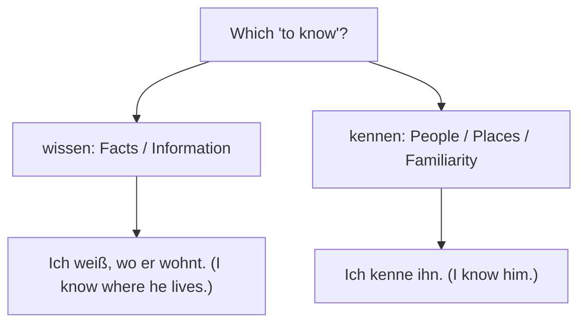

# Chapter 16: Common Mistakes and Pitfalls (Häufige Fehler)

This chapter highlights the most common mistakes English speakers make when learning German, along with explanations on how to avoid them.

---

## 1. wissen vs. kennen (to know)

Both verbs translate to "to know" in English, but they are used in completely different contexts.

* **wissen**: Used for facts, pieces of information, or things you know with certainty. It is often followed by a subordinate clause starting with *dass*, *wo*, *wann*, *wie*, etc.
  * *Correct*: Ich **weiß** die Antwort. *(I know the answer.)*
  * *Correct*: Ich **weiß**, wie man das macht. *(I know how to do that.)*
* **kennen**: Used for being familiar with people, places, books, or things (equivalent to "to be acquainted with"). It always takes a direct object (Accusative).
  * *Correct*: Ich **kenne** diesen Mann. *(I know this man.)*
  * *Correct*: Ich **kenne** Berlin gut. *(I know Berlin well.)*

---

## 2. sein vs. werden (to be vs. to become)

English speakers often confuse these when talking about their future professions or states.

* **sein** (to be): Describes a static state.
  * *Correct*: Ich **bin** müde. *(I am tired.)*
  * *Correct*: Ich **bin** Lehrer. *(I am a teacher.)*
* **werden** (to become): Describes a process of change or transition.
  * *Correct*: Ich **werde** müde. *(I am getting/becoming tired.)*
  * *Correct*: Ich **werde** Lehrer. *(I will become a teacher / I am studying to be a teacher.)*

> [!WARNING]
> Saying "Ich werde Arzt" means "I am becoming a doctor." If you say "Ich will Arzt werden", it means "I want to become a doctor." Do not say "Ich will Arzt sein" unless you are already one and want to remain one.

---

## 3. False Friends (Falsche Freunde)

These are words that look or sound similar in German and English but have completely different meanings.

| German Word | What it looks like | What it actually means | How to say the English word in German |
| :--- | :--- | :--- | :--- |
| **bekommen** | to become | **to get / to receive** | werden |
| **aktuell** | actual | **current / up-to-date** | tatsächlich |
| **eventuell** | eventually | **possibly / perhaps** | schließlich |
| **die Promotion** | promotion | **PhD / doctoral degree** | die Beförderung |
| **spenden** | to spend (money) | **to donate** | ausgeben |

* *Incorrect*: Ich will ein Arzt *bekommen*. *(Sounds like: "I want to receive a doctor".)*
* *Correct*: Ich will ein Arzt **werden**. *(I want to become a doctor.)*

---

## 4. Word Order: Verb Position in Subordinate Clauses

English speakers often forget to move the verb to the end of a subordinate clause (introduced by words like *weil*, *dass*, *wenn*).

* *Incorrect*: Ich bleibe zu Hause, weil ich *bin* krank.
* *Correct*: Ich bleibe zu Hause, weil ich krank **bin**. *(The verb 'bin' must go to the very end.)*
