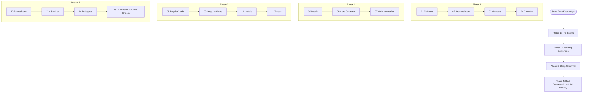
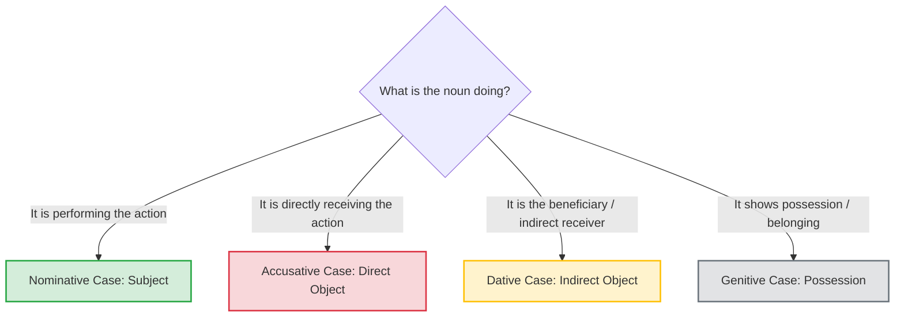

# German Master Guide: Your Roadmap from Zero to B1 🇩🇪

Servus! Welcome to the **German Master Guide**. If you've ever wanted to learn German but got scared off by words like *Geschwindigkeitsbegrenzung* or the infamous four cases, you are in the right place. 

This textbook is designed to take you from absolute zero (knowing how to say *Bier* and *Danke*) all the way to an intermediate B1 level. We don't do boring, dry grammar lectures here. Instead, we break down the logic of the language with clear cheat sheets, visual flowcharts, and real-world conversations.

---

## The Learning Journey at a Glance

Here is how you will progress through this book:

---

## Why German is Actually Awesome (and Logical!)

A lot of people think German is incredibly difficult. But here is a secret: **German is like Lego.** 

Once you learn the individual blocks (the prefixes, suffixes, and root words), you can snap them together to build almost any word you want. For example:
* **das Auto** (car) + **die Bahn** (track/train) = **die Autobahn** (highway)
* **das Spiel** (play) + **das Zeug** (stuff) = **das Spielzeug** (toy)
* **die Hand** (hand) + **der Schuh** (shoe) = **der Handschuh** (glove)

### The Case System Decision Tree

To give you a taste of how logical the grammar is, here is how you decide which case to use in a sentence:

---

## What’s Inside? (Chapter Breakdown)

Here is a quick look at the chapters you'll find in this guide:

* **01_Alphabet**: Learn the German ABCs, including those funny-looking dots (Umlauts: Ä, Ö, Ü) and the double-S beta lookalike (ß).
* **02_Pronunciation**: Say goodbye to accent struggles. We teach you how to master the German "r", the throat-clearing "ch", and how to stress words like a native.
* **03_Numbers**: Count from 0 to a billion. Get ready for the reverse rule: 21 is spoken as "one-and-twenty" (*einundzwanzig*).
* **04_Dates_Time**: Learn the days, months, seasons, and how to tell time. (Warning: "halb vier" means 3:30, not 4:30!).
* **05_Vocabulary**: Essential words for family, office, food, travel, and shopping, organized by category.
* **06_Grammar**: The big picture. How sentences are structured (V2 rule and TeKaMoLo), relative clauses, and the passive voice.
* **07_Master_Verb_Conjugation**: Learn how German verbs change depending on who is doing the action.
* **08_Regular_Verbs**: 20 everyday verbs that follow the rules perfectly (like *machen*, *lernen*, *arbeiten*).
* **09_Irregular_Verbs**: 25 strong and mixed verbs that like to break the rules (like *sein*, *haben*, *werden*).
* **10_Modal_Verbs**: The helper verbs (*can*, *must*, *want*, *should*, *may*, *like*) and how they change word order.
* **11_Tenses**: How to talk about the past, present, and future, plus how to express wishes (*I would like...*).
* **12_Prepositions**: The little words (*with*, *for*, *at*, *in*) that force nouns into specific cases.
* **13_Adjectives**: How to describe things and how to change adjective endings based on the noun.
* **14_Conversations**: Real-world dialogues for ordering food, asking for directions, and meeting people.
* **15_Exercises**: Practice worksheets with fill-in-the-blanks and translation exercises to test yourself.
* **16_Common_Mistakes**: Avoid the classic "English-speaker" traps, like confusing *wissen* and *kennen*.
* **17_Cheat_Sheets**: High-density reference tables for quick lookups before an exam.
* **18_1000_Common_Words**: The top 1,000 most frequently used German words with example sentences.

---

## Gamify Your Study: The 4-Step Weekly Habit

To make this stick, try this simple weekly routine:

```mermaid
gantt
    title Weekly Study Flow
    dateFormat X
    axisFormat %s

    section Study
    Learn 1 Grammar Topic      :active, grammar, 0, 2
    Memorize 15 Vocab Words    :vocab, after grammar, 2

    section Practice
    Write 5 Sentences          :writing, after vocab, 2
    Speak Out Loud (Self-Talk) :speaking, after writing, 2

    section Review
    Do Chapter Exercises       :review, after speaking, 2
```

1. **Monday (Input)**: Read one grammar chapter (e.g., Chapter 6 or 12).
2. **Tuesday (Vocab)**: Learn 15 new words from Chapter 5 or 18. Write them down using colors (Blue for masculine, Red for feminine, Green for neuter).
3. **Wednesday & Thursday (Output)**: Write 5 sentences using your new grammar and vocab. Talk to yourself in the shower or describe what you are doing out loud in German.
4. **Friday (Check)**: Complete the exercises in Chapter 15 and check your answers.

*Viel Erfolg!* (Good luck!) You've got this.
