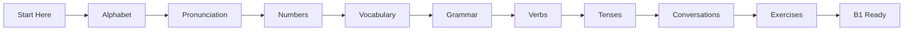
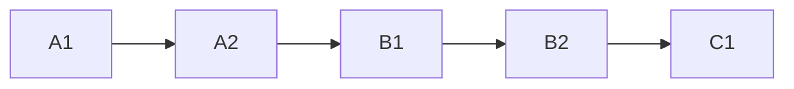
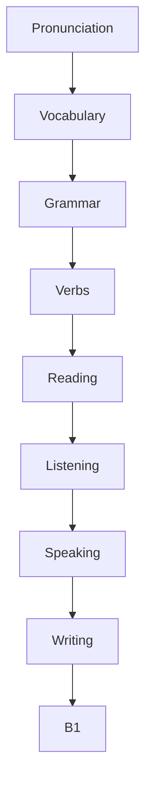
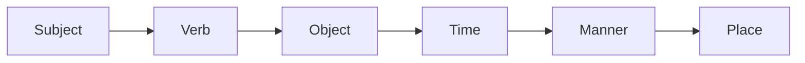
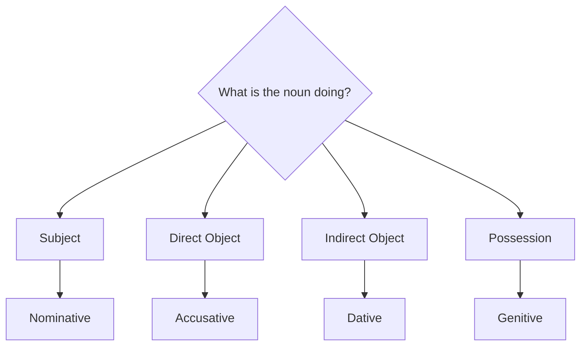
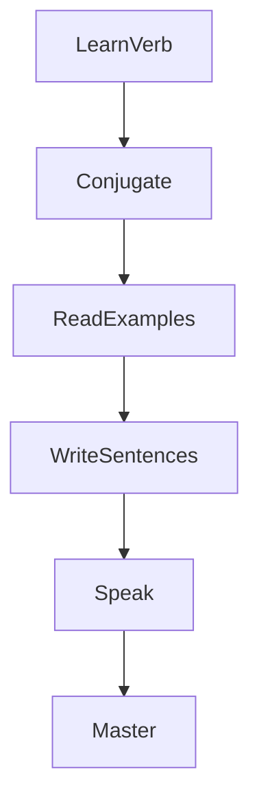
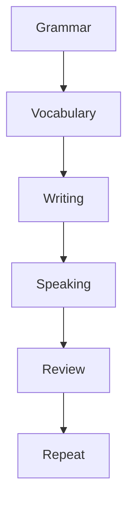

# German Master Guide 🇩🇪

An open-source, comprehensive, self-study German language textbook designed to take learners from absolute zero to intermediate (B1) proficiency. This project is structured as a series of clean, markdown-based chapters optimized for GitHub, Obsidian, VS Code, and static site generators.

---

## Overview

The German Master Guide provides a structured, clear, and highly detailed curriculum for learning German. Unlike phrasebooks or gamified apps, this project focuses on explaining the underlying logic and grammatical framework of the language, enabling learners to build their own sentences accurately.

---

## Features

* **Structured Curriculum**: A logical progression from phonetics to complex B1 sentence structures.
* **Grammar Explanations**: Deep dives into cases, adjective declensions, relative clauses, and passive voice.
* **Verb Documentation**: Comprehensive profiles of 50+ regular, irregular, and modal verbs with full tense tables.
* **Pronunciation Guides**: Easy-to-read English phonetic spelling for all vocabulary, verbs, and dialogue sentences.
* **Real-World Dialogues**: Situational conversations covering travel, shopping, healthcare, and daily life.
* **Practice Exercises**: Chapter-by-chapter worksheets with complete answer keys.
* **High-Density Cheat Sheets**: Quick-reference tables for cases, pronouns, and prepositions.

---

## Learning Roadmap

This project is organized into four main phases of study:



### Language Progression



---

## Project Structure

The textbook is divided into the following files:

```text
German-Master-Guide/
├── README.md
├── 01_Alphabet.md
├── 02_Pronunciation.md
├── 03_Numbers.md
├── 04_Dates_Time.md
├── 05_Vocabulary.md
├── 06_Grammar.md
├── 07_Master_Verb_Conjugation.md
├── 08_Regular_Verbs.md
├── 09_Irregular_Verbs.md
├── 10_Modal_Verbs.md
├── 11_Tenses.md
├── 12_Prepositions.md
├── 13_Adjectives.md
├── 14_Conversations.md
├── 15_Exercises.md
├── 16_Common_Mistakes.md
├── 17_Cheat_Sheets.md
└── 18_1000_Common_Words.md
```

---

## Example Lesson

Each chapter uses a consistent format, breaking down words and sentences into three parts: the German text, the phonetic pronunciation guide, and the English translation.

### German
Ich lerne Deutsch.

### Pronunciation
Ikh LER-nuh DOYCH.

### Translation
I am learning German.

---

## Learning Philosophy

### 1. Phonetics First
Understanding the spelling rules and sound systems of German prevents pronunciation habits that are difficult to correct later.



### 2. Sentence Structure (Word Order)
German word order is highly structured. The position of the verb is fixed depending on the clause type.



### 3. The Case System
German uses four cases to identify the roles of nouns in a sentence.



### 4. Verb Mastery
Verbs are the core of German sentences. Mastering them requires systematic study of their conjugations and principal parts.



---

## How to Study

To get the most out of these files, we recommend a balanced weekly study schedule:



1. **Grammar**: Study a new concept (e.g., Chapter 06 or 12).
2. **Vocabulary**: Learn 15–20 new words from the corresponding category.
3. **Writing**: Write 5 sentences applying the new grammar and vocabulary.
4. **Speaking**: Read the example sentences and dialogues aloud.
5. **Review**: Complete the exercises in Chapter 15 and correct any mistakes.

---

## Contributing

Contributions to improve explanations, fix typos, or add more exercises are welcome. Please open an issue or submit a pull request.

---

## License

This project is licensed under the MIT License.
